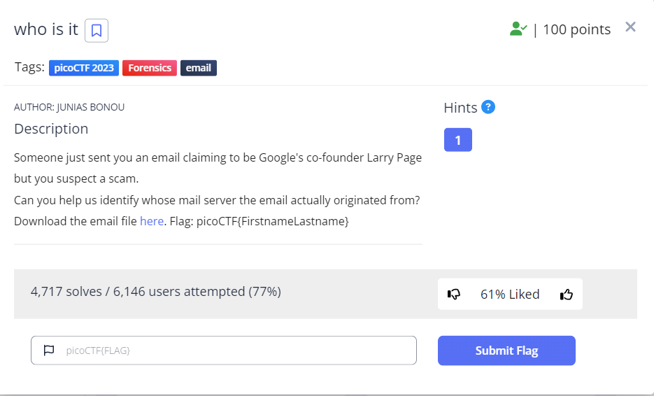
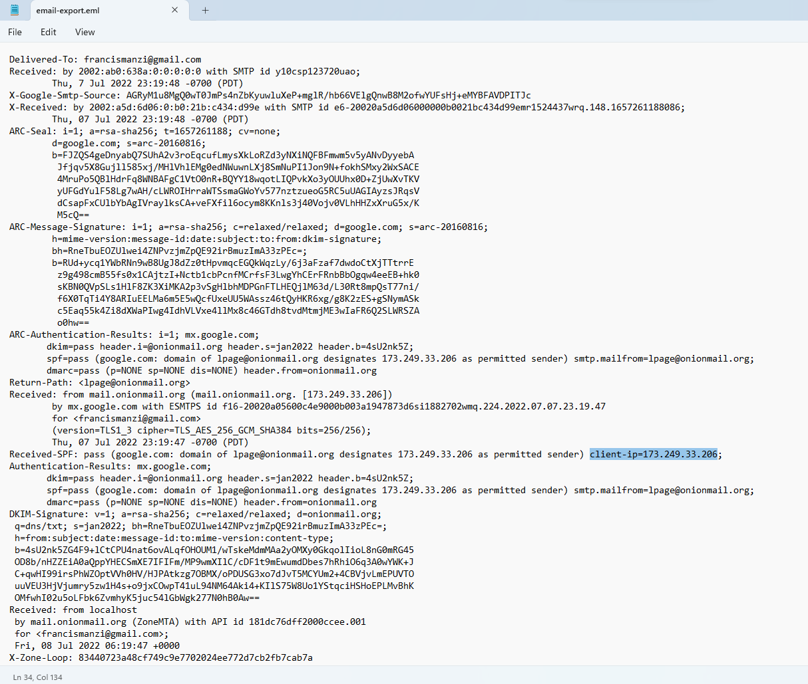
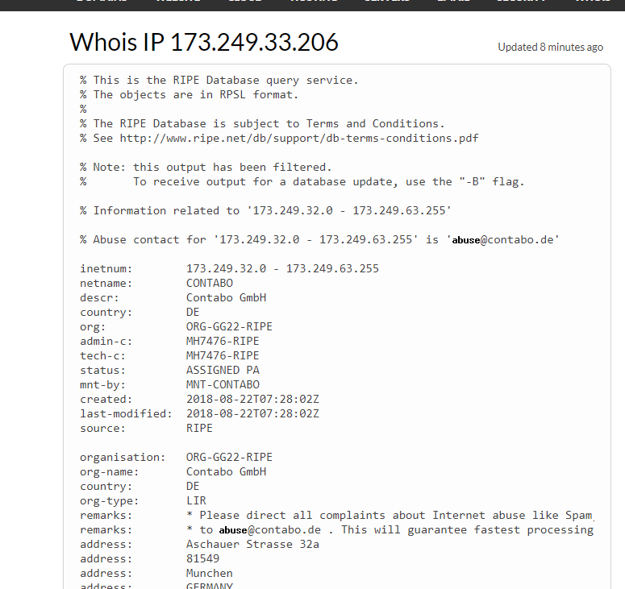
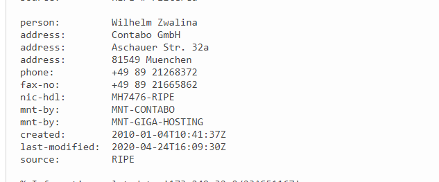

# who is it
This is the write-up for the challenge "who is it" challenge in PicoCTF

# The challenge
Someone just sent you an email claiming to be Google's co-founder Larry Page but you suspect a scam.
Can you help us identify whose mail server the email actually originated from?

## Hints
1. whois can be helpful on IP addresses also, not only domain names.

## Initial look
The challenge provided a .eml file

I opened the email and started looking at it's data, I searched for a domain / ip address 

I searched the web and found a website called whois 
I copied the ip I found and pasted it in the search bar 

I got inforamtion regarding the ip address

The challenge said to search for a name - first and last name, I found a name

I copied the the name and pasted it as flag.
 
The flag is: 'picoCTF{WilhelmZwalina}'

